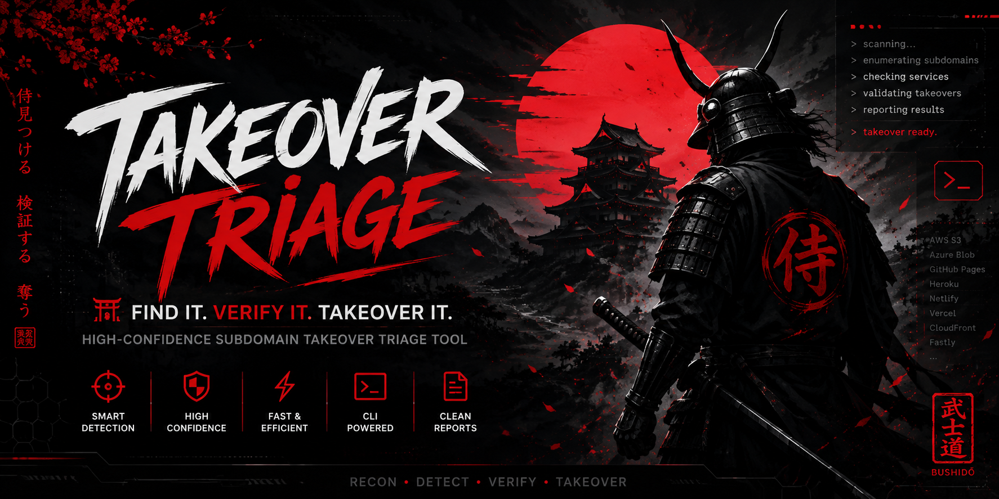

# Takeover Triage

<p align="center">
  
</p>

> High-confidence Subdomain Takeover Triage Tool

Takeover Triage is a high-confidence subdomain takeover scanner designed to reduce false positives through a structured three-gate verification model.

Unlike traditional takeover scanners that rely solely on HTTP fingerprints, Takeover Triage validates DNS state, service behavior, and claimability before recommending manual verification.

---

## Features

- Three-Gate Verification System
- CNAME takeover detection
- NS takeover detection
- Complete CNAME chain analysis
- NXDOMAIN validation
- HTTP fingerprint verification
- Service-aware detection
- DNS-over-HTTPS fallback
- Multi-threaded scanning
- JSON output
- can-i-take-over-xyz cross reference
- Cost warnings for cloud resources
- Detailed verbose mode
- Reduced false positives

---

## Supported Services

- AWS S3
- Azure App Service
- Azure Blob Storage
- Azure Static Website
- Azure Traffic Manager
- Azure API Management
- Azure Cloud Service
- GitHub Pages
- Netlify
- Heroku
- Shopify
- Ghost
- Cargo
- Tumblr
- Readme.io
- Wordpress.com
- Elastic Beanstalk
- SendGrid
- Pantheon
- WP Engine
- Unbounce
- Surge.sh
- Wasabi

and many more...

---

## Installation

Clone the repository

```bash
git clone https://github.com/YOUR_USERNAME/takeover-triage.git
cd takeover-triage
```

Install dependencies

```bash
pip install -r requirements.txt --break-system-packages
```

---

## Usage

Scan a list

```bash
python takeover_triage.py -l subs.txt
```

Verbose mode

```bash
python takeover_triage.py -l subs.txt -v
```

JSON output

```bash
python takeover_triage.py -l subs.txt --json results.json
```

DNS over HTTPS

```bash
python takeover_triage.py -l subs.txt --doh-fallback
```

Cross-reference with can-i-take-over-xyz

```bash
python takeover_triage.py -l subs.txt --xyz
```

Best use-case

```bash
python3 takeover_triage.py -l subs.txt -v --doh-fallback -w 15 -xyz --json results.json
```
---

## Three Gate Verification

```
              Gate 1
      Third-party Service?

              │
              ▼

      Gate 2
      Resource Deleted?

              │
              ▼

      Gate 3
      Claimable?

              │
              ▼

     CONFIRM_MANUALLY
```

---

## Philosophy

```
Trust the fingerprint.

Verify the DNS.

Confirm the claimability.
```

---

## Disclaimer

This tool is intended for authorized security testing only.

Never attempt to claim resources without explicit permission from the asset owner and within the scope of the applicable security program.

---

## License

MIT License

---

## Author

Created by HackMeHat
